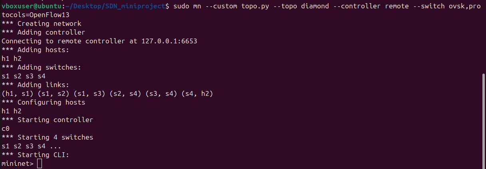
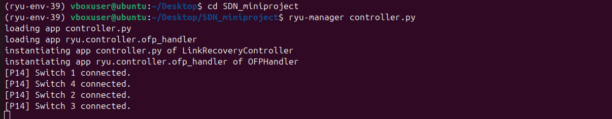
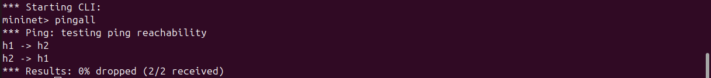
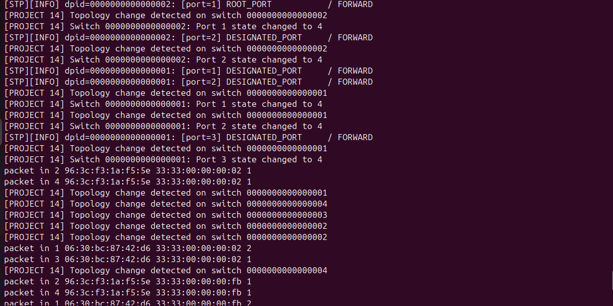
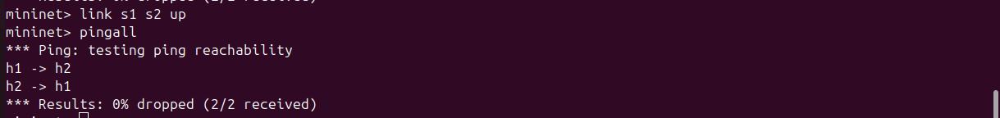
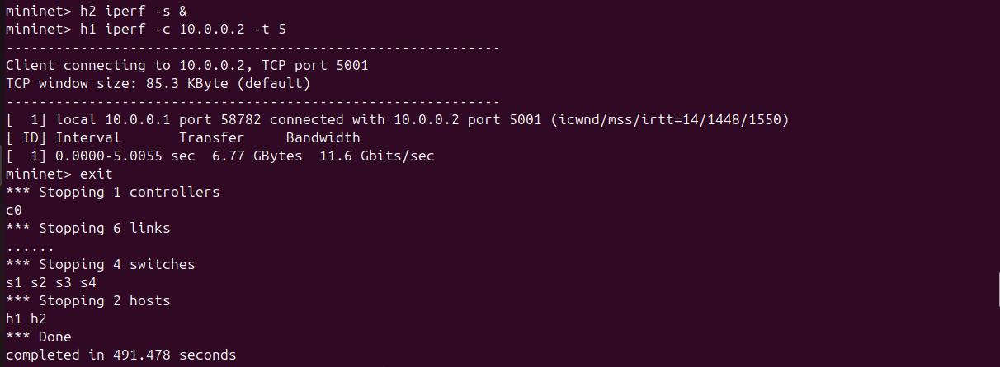
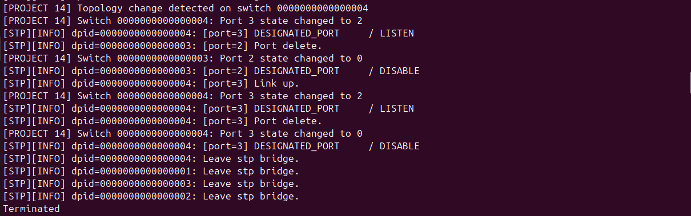

## Problem Statement
Project 14: Detect link failures and update routing dynamically by monitoring topology changes and restoring connectivity through alternate paths. [From SDN Problem Statements document]

## Solution Overview
This project implements an SDN controller using Ryu's STP (Spanning Tree Protocol) with custom topology change detection for a diamond topology with redundant paths between hosts. When a link fails, STP reconverges automatically, and the controller logs topology changes and port state transitions to demonstrate failure detection and recovery.

## Network Topology
```
          h1
           |
          s1
         /  \
       s2    s3  
        \   /
         s4
          |
          h2
```

# Test scenario: Bring down s1-s2 link → traffic recovers via backup path.

## Setup & Execution

## Prerequisites
# Mininet

# Ryu controller (Python 3.9+ environment)

# Open vSwitch with OpenFlow 1.3

## Start Controller
```bash
ryu-manager controller.py
```

## Start Mininet 
```bash
sudo mn --custom topo.py --topo diamond --controller remote --switch ovsk,protocols=OpenFlow13
```

## Test sequence 
```
mininet> pingall                    # Baseline: 0% packet loss
mininet> h1 ping h2                 # Continuous ping (keep running)
mininet> link s1 s2 down            # Simulate link failure
Observe STP reconvergence in controller logs
mininet> h1 iperf h2                # Verify restored connectivity
mininet> link s1 s2 up              # Restore link
mininet> pingall                    # Full recovery confirmation
```

## Key observations 
1) Baseline connectivity
   ```
   *** Results: 0% dropped (2/2 received)
   ```
   
2) Link failure detection 
  ```
  [PROJECT 14] Topology change detected on switch 0000000000000001
  [PROJECT 14] Switch 0000000000000001: Port 2 state changed to BLOCK
  [PROJECT 14] Switch 0000000000000002: Port 1 state changed to LISTEN
  ```

3) STP reconvergence 
   DESIGNATED_PORT / LISTEN → BLOCK → FORWARD
   Backup path (s1→s3→s4) becomes active

4) Connectivity recovery
   ```[  5.0Kbits/sec]  [   <=  =>]  0.00-5.00  sec  16.6 GBytes  16.1 Gbits/sec```

## References
Ryu STP Documentation

Mininet OpenFlow 1.3 Walkthrough

SDN Problem Statements (Project 14)

## Files
topo.py - Diamond topology (4 switches, 2 hosts, redundant paths)

controller.py - Ryu STP controller with Project 14 logging

Screenshots - Complete failure/recovery demo sequence

## Screenshots 
1) Topology startup
   
   
   
3) Baseline pingall
  
   
4) Link failure
  
   
5) STP recovery
   
   
6) Post recovery
   
   
7) Exit
   
   
   
